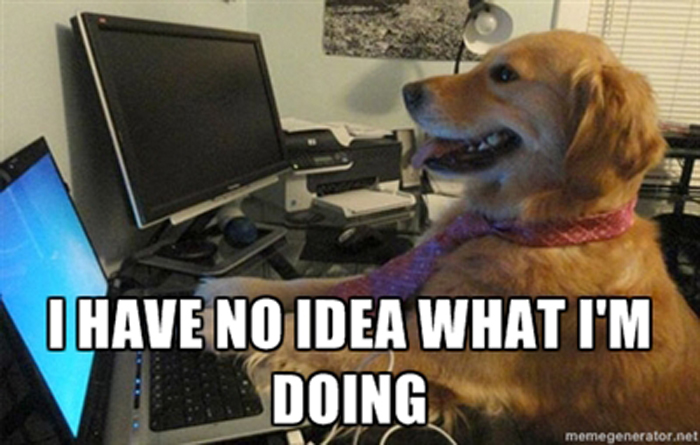

# Omnifocus Level Up

A set of scripts to create tasks and mark them as done automatically in
Habitica.

## How does this script works

* You check something as done in OmniFocus
* Magic make the script run
* The script create a tasks in Habitica and mark it done immediatly

## This script will not

* Sync habitica to OmniFocus
* Sync undone task to Habitica
* Sync or track habits and dailies

## Why?

I don't use Habitica for my daylies or todo anymore, but I don't wanted to pass
on the sweet sweet XP of done tasks.

Thus, this script.

## :warning: WARNING :warning:

This may break your Habitica. It should not break your OmniFocus (it only read
stuff), but remember that:

## How to use

Work in progress, you are on your own for know!
